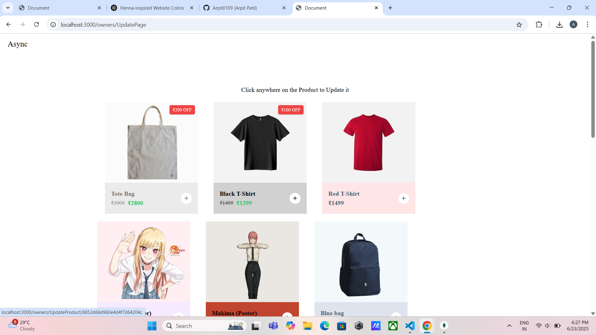

# 🛒 Async – E-commerce Store

Async is a Node.js + Express-based e-commerce web application where users can browse, search, and buy products (like posters), and admins can manage product listings. Built with MongoDB, EJS, and several powerful features like cart handling, discount filters, and fuzzy search.

---

## 🚀 Features

- 👤 User authentication (with session-based login)
- 🛍️ Product listing, filtering, and search using **Fuse.js**
- 🛒 Cart system for users
- 🔍 Fuzzy search by product name
- 🎨 Product type filters and sorting (e.g., newest, discounted)
- 🛠️ Admin panel for:
  - Creating products
  - Updating existing products
  - Uploading product images
- 📦 Image upload using **Multer**
- ✨ Flash messages for success and error feedback

---


## 📸 Screenshots

### 🔐 Login Page


### 🏠 Home Page


### 🛍️ Search Product


### 🏷️ Discounted Product


### 🛠️ Create Product (Admin)


### 🔧 Update Product (Admin)



## 📂 Project Structure

Async/
│
├── models/ # Mongoose models (User, Product, Owner)
├── routes/ # Express routes (users, owners, index, products)
├── views/ # EJS templates
├── public/ # Static assets (CSS, images)
├── config/ # Multer and DB config
├── .env # Environment variables
├── app.js # Main Express app
└── package.json


---

## 🧰 Tech Stack

- **Backend**: Node.js, Express
- **Database**: MongoDB + Mongoose
- **Templating**: EJS
- **Authentication**: Express Session + Flash
- **File Upload**: Multer
- **Search**: Fuse.js
- **Styling**: Custom CSS or any frontend framework

---

## 🔧 Installation

1. **Clone the repo**
```bash
git clone https://github.com/Arpit0109/-Async-E-commerce-Store.git
cd async-ecommerce

2. Install dependencies
npm install

3. Create a .env file (or copy from .env.example)

JWT_KEY=your_jwt_secret_here
EXPRESS_SESSION_SECRET=your_session_secret_here
MONGODB_URI=mongodb://localhost:27017/async-ecommerce
NODE_ENV=development

4. Start the server
node app.js
Server will be running at: http://localhost:3000


---


## 🙋‍♂️ Author
**Arpit Patil**  
[GitHub: Arpit0109](https://github.com/Arpit0109)
